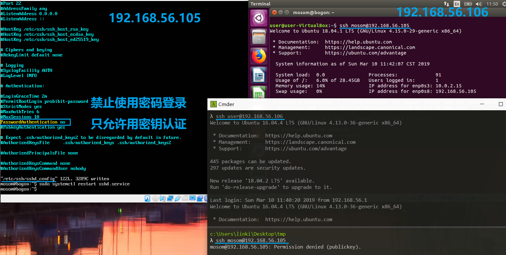
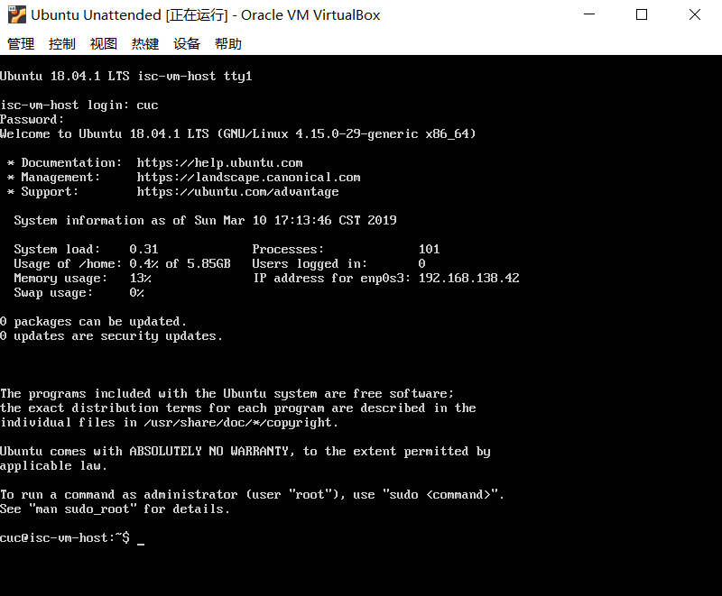

## 无人值守Linux安装镜像制作

要求：
- 定制用户名和默认密码
- 定制安装OpenSSH Server
- 安装过程禁止自动联网更新软件包

### 实验环境
Ubuntu18.04 Server
- 别名：18.04
- 网卡：NAT、Host-Only
- 镜像：ubuntu-18.04.1-server-amd64.iso

Ubuntu16.04 Desktop
- 别名：16.04
- 网卡：NAT、Host-Only
- 镜像：ubuntu-16.04.4-desktop-amd64.iso
- 用途：ssh跳板

### 实验步骤

#### 网络配置
添加并启用 Host-Only 网卡
- 命令行直接配置

```bash
# 查看所有网卡
ifconfig -a

# 查看未开启的网卡
diff <(ifconfig -a) <(ifconfig)

# 启用第二块网卡
sudo ifconfig enp0s8 up

# 获取ip等信息
sudo dhclient enp0s8

# 查看网卡
ifconfig | grep "enp0s8" -A 9
```


不修改 `/etc/network/interfaces` ，使用 `netplan` 进行配置

```bash
# 查看配置文件
ls /etc/netplan/

# 修改配置文件
sudo vi /etc/netplan/01-netcfg.yaml

# 启用配置
sudo netplan apply
```


#### 远程连接配置

在服务器上安装 openssh-server
- 安装完毕后默认启用

```bash
# 更新源
sudo apt update

# 安装 OpenSSH 服务器应用
sudo apt install openssh-server

# 在本地进行远程连接
# 输入密码即可远程登录服务器
ssh mosom@192.168.56.102
```


##### SSH 免密登录

在本地 Windows 主机上使用 git bash
- 生成密钥对：`ssh-keygen -t rsa`
- 将公钥发送至服务器：`ssh-copy-id mosom@192.168.56.102`
  - 需输入密码
- 免密登录：`ssh mosom@192.168.56.102`


在本地 Windows 主机上使用 cmder
- 只有 `ssh` 没有 `ssh-copy-id`

```bash
# 手动配置
cat ~/.ssh/id_rsa.pub | ssh mosom@192.168.56.102 "mkdir -p ~/.ssh && touch ~/.ssh/authorized_keys && chmod -R go= ~/.ssh && cat >> ~/.ssh/authorized_keys"
```


##### SSH 跳板登录

16.04 和 18.04 上都安装 openssh-server 并进行免密登录配置
- 删除 18.04 上的认证密钥：`sudo rm ~/.ssh/authorized_keys`
- 16.04 上存放 Windows 公钥，18.04 上存放 16.04 公钥：`Windows --> 16.04 --> 18.04`
- *经验证这并不是所谓的“跳板”登录* :sweat_smile:

```bash
# 18.04
# 修改配置文件，禁止密码认证（即只允许通过公私钥认证）
sudo vi /etc/ssh/sshd_config

# 重启 sshd 服务
sudo systemctl restart sshd.service
```




跳板登录的意思是从 Windows 和 16.04 建立的 SSH 连接中，再建立 Windows 和 18.04 的SSH连接
- 在本地 Windows 主机上配置config文件
  - 若无，则在 .ssh 目录下新建
- 环境配置
  - 16.04 上存放 Windows 公钥
  - 18.04 上存放 Windows 公钥

以下为配置文件内容，指定 16.04 为跳板主机

*ps：做这个实验时两台虚拟主机的ip地址经过修改*

```
# Host 自定义主机名称
# HostName ip地址
# User 主机上的用户名称
# ProxyCommand 建立跳板登录
Host 16.04
	HostName 192.168.56.106
	Port 22
	User user

Host 18.04
	HostName 192.168.56.105
	Port 22
	User mosom
	ProxyCommand ssh 16.04 -W %h:%p
```


#### 定制镜像

先将镜像文件挂载到linux的一个文件目录中，再对其中的配置文件进行修改

```bash
# 在当前用户目录下创建一个用于挂载iso镜像文件的目录
mkdir loopdir

# 下载所需的iso镜像文件
wget http://old-releases.ubuntu.com/releases/18.04.0/ubuntu-18.04.1-server-amd64.iso

# 上传本地iso镜像文件（推荐）
# Windows git-bash
scp ubuntu-18.04.1-server-amd64.iso mosom@192.168.56.102:~

# 挂载iso镜像文件到该目录
# -o loop 用来把一个文件当成硬盘分区挂接上系统
# ubuntu-18.04.1-server-amd64.iso 设备文件名
# loopdir 挂载点
sudo mount -o loop ubuntu-18.04.1-server-amd64.iso loopdir
# mount: /home/mosom/loopdir: WARNING: device write-protected, mounted read-only.

# 创建一个工作目录用于克隆光盘内容
mkdir cd
 
# 同步光盘内容到目标工作目录
# 一定要注意loopdir后的这个/，cd后面不能有/
# -a, --archive 归档模式，表示以递归方式传输文件，并保持所有文件属性
# -v, --verbose 详细模式输出
rsync -av loopdir/ cd

# 卸载iso镜像
sudo umount loopdir

# 进入目标工作目录
cd cd/

# 编辑Ubuntu安装引导界面增加一个新菜单项入口
# 修改配置以识别 ubuntu-server-autoinstall.seed
sudo vi isolinux/txt.cfg

# 在文件中添加以下内容
# 强制保存 `:w!`
label autoinstall
  menu label ^Auto Install Ubuntu Server
  kernel /install/vmlinuz
  append  file=/cdrom/preseed/ubuntu-server-autoinstall.seed debian-installer/locale=en_US console-setup/layoutcode=us keyboard-configuration/layoutcode=us console-setup/ask_detect=false localechooser/translation/warn-light=true localechooser/translation/warn-severe=true initrd=/install/initrd.gz root=/dev/ram rw quiet

# 修改配置缩短超时等待时间
# timeout 10
sudo vi isolinux/isolinux.cfg
```


使用定制的预置文件，配置了安装时的默认选择

```bash
# 上传 ubuntu-server-autoinstall.seed
# Windows git-bash
scp ubuntu-server-autoinstall.seed mosom@192.168.56.102:~

# 移动到指定目录下
sudo mv ubuntu-server-autoinstall.seed ~/cd/preseed/

# 重新生成md5sum.txt
find . -type f -print0 | xargs -0 md5sum > /tmp/md5sum.txt
sudo mv /tmp/md5sum.txt md5sum.txt

# 无 mkisofs 命令（提示安装genisoimage）
mkisofs --help

# 查找并安装相应的软件包
apt-cache search mkisofs
sudo apt install genisoimage

# 以下为 bash 脚本，保存为 gen_iso.sh
# 封闭改动后的目录到.iso
IMAGE=custom.iso
BUILD=~/cd/

mkisofs -r -V "Custom Ubuntu Install CD" \
            -cache-inodes \
            -J -l -b isolinux/isolinux.bin \
            -c isolinux/boot.cat -no-emul-boot \
            -boot-load-size 4 -boot-info-table \
            -o $IMAGE $BUILD

# 执行脚本以生成镜像文件
sudo bash gen_iso.sh
```


#### 实验结果
将生成的镜像文件拷贝到本地，用来进行自动化安装

```bash
# 拷贝到当前文件夹
# Windows git-bash
scp mosom@192.168.56.102:~/custom.iso .
```

16min 的安装过程硬生生压成了 10s


输入预先定制的用户名和密码即可进入系统



### 文件比对

直接使用命令行工具 diff 对比两个文件
- [对比结果](diff.txt) 直接看着略难受

```bash
# 将对比结果写入 diff.txt 中
diff ubuntu-server-autoinstall.seed example-preseed.txt > diff.txt
```

使用 Beyond Compare
- 下载并安装后，直接将需要对比的两个文分别件拖入左、右窗口，将对比结果导出为 [diff.html](https://htmlpreview.github.io/?https://github.com/CUCCS/linux-2019-jckling/blob/0x01/0x01/diff.html)

其中每一部分的差异如下：
- stretch → xenial
  - `cat /etc/debian_version` 输出 `buster/sid`
  - 参阅：[What Debian version are the different Ubuntu versions based on?](https://askubuntu.com/questions/445487/what-debian-version-are-the-different-ubuntu-versions-based-on)
- 预置locale，指定支持的语言与地区的组合
  - 跳过选择语言支持软件包
- 不指定网卡
- 将链路检测超时时间缩减为5
- 将等待DHCP服务器超时时间缩减为5
- 手动配置网络
- 配置网络
- 配置主机名和域名
  - 从dhcp分配的任何主机名和域名优先于此处设置的值
- 强制设置主机名 isc-vm-host
- 设置镜像
- 设置镜像
- 创建普通用户（设置名称全称）
  - 设置名称
- 创建普通用户密码
  - 再次确认
- 设置时区
- 在安装期间不使用NTP设置时钟
  - Network Time Protocol
- 如果系统具有可用空间，则可以选择仅对该空间进行分区
- 使用LVM对磁盘进行分区，设置逻辑卷的大小为最大
- 预定义分区方案
  - multi:  separate /home, /var, and /tmp partitions
- 禁用网络镜像
- 选择安装server软件包
- 安装openssh-server
- 禁止自动升级软件包
- 升级策略：自动更新

### 参阅
- [Netplan configuration examples](https://netplan.io/examples)
- [OpenSSH 服务器](https://help.ubuntu.com/18.04/serverguide/openssh-server.html)
- [How To Set Up SSH Keys on Ubuntu 16.04](https://www.digitalocean.com/community/tutorials/how-to-set-up-ssh-keys-on-ubuntu-1604#step-3-%E2%80%94-authenticate-to-ubuntu-server-using-ssh-keys)
- [SSH Jump Host WITHOUT Agent Forwarding](https://stackoverflow.com/questions/41748491/ssh-jump-host-without-agent-forwarding)
- [SSH config ProxyCommand asks for public key](https://serverfault.com/questions/724721/ssh-config-proxycommand-asks-for-public-key)
- [What Debian version are the different Ubuntu versions based on?](https://askubuntu.com/questions/445487/what-debian-version-are-the-different-ubuntu-versions-based-on)
- [Install CD Customization](https://help.ubuntu.com/community/InstallCDCustomization)
- [B.4. 预置文件的内容(stretch)](https://www.debian.org/releases/stable/i386/apbs04.html.zh-cn)
- [How do I configure a preseed to skip the language support question?](https://askubuntu.com/questions/129651/how-do-i-configure-a-preseed-to-skip-the-language-support-question)
- [How do I create an EFI-bootable ISO of a customized version of Ubuntu?](https://askubuntu.com/questions/457528/how-do-i-create-an-efi-bootable-iso-of-a-customized-version-of-ubuntu)
- [How do I create a completely unattended install of Ubuntu Desktop 16.04.1 LTS?](https://askubuntu.com/questions/806820/how-do-i-create-a-completely-unattended-install-of-ubuntu-desktop-16-04-1-lts)