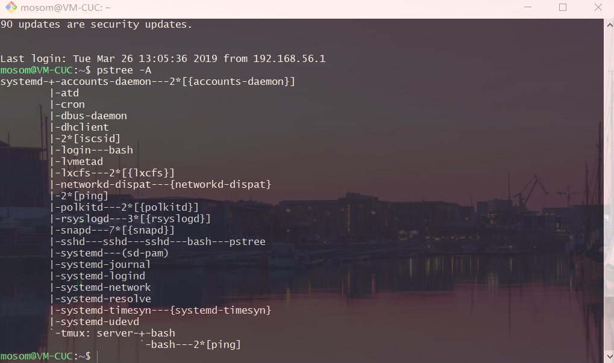

### 文件列表

```bash
# list directory contents
ls -l /dev/null
ls -l /usr/bin/passwd
ls -l /etc/shadow

# -d    list directories themselves, not their contents
ls -ld /etc/
ls -ld /tmp

# 输出默认颜色设置
dircolors -p

# 查看 dircolor 配置文件
man dir_colors

# Color
               0   to restore default color
               1   for brighter colors
               4   for underlined text
               5   for flashing text
              30   for black foreground
              31   for red foreground
              32   for green foreground
              33   for yellow (or brown) foreground
              34   for blue foreground
              35   for purple foreground
              36   for cyan foreground
              37   for white (or gray) foreground
              40   for black background
              41   for red background
              42   for green background
              43   for yellow (or brown) background
              44   for blue background
              45   for purple background
              46   for cyan background
              47   for white (or gray) background

# Setting
       NORMAL    0           Normal (nonfilename) text
       FILE      0           Regular file
       DIR       32          Directory
       LINK      36          Symbolic link
       ORPHAN    undefined   Orphaned symbolic link
       MISSING   undefined   Missing file
       FIFO      31          Named pipe (FIFO)
       SOCK      33          Socket
       BLK       44;37       Block device
       CHR       44;37       Character device
       EXEC      35          Executable file
```

### 磁盘信息

```bash
# 列出当前工作目录
pwd

# 文件系统磁盘空间使用情况
df -h

# 磁盘分区表
sudo fdisk -l

# 静态文件系统信息
cat /etc/fstab
```

### 命令类型判断

```bash
cmds=(echo cd history getopts kill pwd); for cmd in "${cmds[@]}";do type -a "$cmd";done
# echo is a shell builtin
# cd is a shell builtin
# history is a shell builtin
# getopts is a shell builtin
# kill is a shell builtin
# kill is /bin/kill
# pwd is a shell builtin
# pwd is /bin/pwd
```

### 用户/组与权限管理

```bash
# change user ID or become superuser
su

# FILES
       /etc/passwd
           User account information.

       /etc/shadow
           Secure user account information.

       /etc/login.defs
           Shadow password suite configuration.


# execute a command as another user
sudo

# su - make the shell a login shell
sudo su -

# edit the sudoers file
visudo

# change user password
passwd

# friendlier front ends
adduser
deluser
addgroup

# low level tools
useradd
userdel
groupadd
usermod

# get/set file access control lists
getfacl
setfacl

# change file mode bits
chmod
chmod 4755 filename # 设置SUID
chmod 2755 dirname  # 设置SGID
chmod 6755 filename # 同时设置SUID和SGID
chmod 1755 dirname  # 设置Sticky Bit

# change file owner and group
chown

# change group ownership
chgrp

# display or set file mode mask
umask

# print real and effective user and group IDs
id
id -g # print only the effective group ID
id -u # print only the effective user ID

# 使用 ls 查看文件/目录权限
ls -ld /tmp
ls -l /dev/null
ls -l /usr/bin/passwd
ls -l /etc/shadow
```

character|file type
-|-
b|block device file
c|character device file
d|directory
l|symbolic link
s|socket file
p|named pipe
-|regular file

```bash
# regular file
touch testfile
rm testfile

# directory
mkdir testdir
rmdir testdir
rm -rf testdir

# block device
ls -ld /dev/sda

# socket
ls -l /dev/log

# named pipe
mknod testpipe
rm testpipe

# symbolic links
touch file1
echo file1 > file1
ln -s file1 file2
cat file2
rm file1 file2
```

### TMUX

#### ping

```bash
# redirect stderr and stdout to null device
ping www.baidu.com 2>&1 1>/dev/null &
ping sec.cuc.edu.cn 2>&1 1>/dev/null &

# report a snapshot of the current processes
# To see every process on the system using BSD syntax
ps aux | grep ping

# display a tree of processes
pstree -A

# use tmux and repeat steps
tmux
```

<a href="https://asciinema.org/a/gkmMRCOO9u9LtUIpmxPsNx6se?autoplay=1" target="_blank"></a>

从进程树可以看出 ssh 和 tmux 下都有 ping 的进程，但是退出再连接至服务器时，ssh下的进程就清空了，而 tmux 中的 ping 进程还在



### 逻辑卷管理 LVM

```bash
# LVM2 tools
man lvm

# Display information about physical volumes
pvs -a

# Display information about volume groups
vgs -a

# Display information about a logical volume
lvdisplay

# Display information about logical volumes
lvs -a
lvs --longhelp
lvs -o +devices
```

文件系统格式
- ext3 / ext4 / swap
- mkfs    # build a Linux filesystem
- mkswap    # set up a Linux swap area
- swapon, swapoff   # enable/disable devices and files for paging and swapping
- free    # Display amount of free and used memory in the system

文件分区
- 分区原则与策略
- fdisk # manipulate disk partition table
- 大于2TB分区 parted  # a partition manipulation program

文件系统挂载
- U盘 / NFS / iso / 光盘
- /etc/fstab    # static file system information

文件和目录属主信息的保存
- rsync   # a fast, versatile, remote (and local) file-copying tool
- `rsync -a SRC DEST`

存储设备与文件系统挂载（开机自动挂载、网络文件系统挂载、iso文件挂载等）
- mount/umount  # 使用 type 指定挂载文件类型
- blkid   # 列出块设备信息，UUID
- lsblk   # 列出块设备信息
- /etc/fstab    # UUID 开机自动挂载

备份
- 手滑试了一下并没有耐心没等压缩就退出不干了 :sweat_smile:

```bash
# 进入根目录
cd /

# 忽略 /proc, /sys, /mnt, /media, /run, /dev, /backup.tar.gz
sudo tar -cvpzf backup.tar.gz --exclude=/backup.tar.gz --one-file-system / 

# 解压并覆盖
sudo tar -xvpzf /path/to/backup.tar.gz -C /media/whatever --numeric-owner

# local Backup
sudo rsync -azvv folder1 folder2
```

### NETPLAN

用 netplan 进行网络配置，编辑 .yaml 配置文件

```bash
# YAML network configuration abstraction for various backends
netplan

# /etc/netplan/*.yaml
netplan apply
```

一个配置文件示例

```yaml
network:
  version: 2
# renderer: NetworkManager
  renderer: networkd
  ethernets:
    enp3s0:
      dhcp4: true 
    enp5s0:
      addresses:
        - 10.10.10.2/24
      match:
        macaddress: 56:2d:d1:8e:62:17
      gateway4: 10.10.10.1
      nameservers:
          search: [mydomain, otherdomain]
          addresses: [10.10.10.1, 1.1.1.1]
```

### iproute2

iproute2 工具集合替代了 `ifconfig`、`route`、`arp`、`iptunnel`、`netstat`等，以下为一些常见命令

```bash
# show / manipulate routing, network devices, interfaces and tunnels
ip
ip addr   # Shows addresses assigned to all network interfaces
ip neigh    # Shows the current neighbour table in kernel
ip link x up/down   #  Bring up/dowm interface x
ip route    # Show table routes

# show / manipulate wireless devices and their configuration
iw
```

### 参阅
- ['sudo su -' vs 'sudo -i' vs 'sudo /bin/bash' - when does it matter which is used, or does it matter at all?](https://askubuntu.com/questions/376199/sudo-su-vs-sudo-i-vs-sudo-bin-bash-when-does-it-matter-which-is-used)
- [Unix file types](https://www.wikiwand.com/en/Unix_file_types)
- [Identifying File types in Linux](https://linuxconfig.org/identifying-file-types-in-linux)

- [How does the sticky bit work?](https://unix.stackexchange.com/questions/79395/how-does-the-sticky-bit-work)
- [Linux umask command](https://www.computerhope.com/unix/uumask.htm)

- [Tmux Cheat Sheet & Quick Reference](https://tmuxcheatsheet.com/)
- [In the shell, what does “ 2>&1 ” mean?](https://stackoverflow.com/questions/818255/in-the-shell-what-does-21-mean)
- [demo of background job in bash and basic process management](https://asciinema.org/a/f3ux5ogwbxwo2q0wxxd0hmn54)

- [Lvm](https://wiki.ubuntu.com/Lvm)
- [LVM](https://wiki.debian.org/LVM)
- [tar](https://help.ubuntu.com/community/BackupYourSystem/TAR)
- [rsync](https://help.ubuntu.com/community/rsync)

- [Netplan](https://netplan.io/)
- [Netplan configuration examples](https://netplan.io/examples#using-dhcp-and-static-addressing)

- [iproute2](https://en.wikipedia.org/wiki/Iproute2)
- [iproute2 Gentoo Linux](https://wiki.gentoo.org/wiki/Iproute2)


- [Systemd](https://wiki.archlinux.org/index.php/systemd_(%E7%AE%80%E4%BD%93%E4%B8%AD%E6%96%87))
- [LSBInitScripts](https://wiki.debian.org/LSBInitScripts)
- [bootup — System bootup process](https://www.freedesktop.org/software/systemd/man/bootup.html)