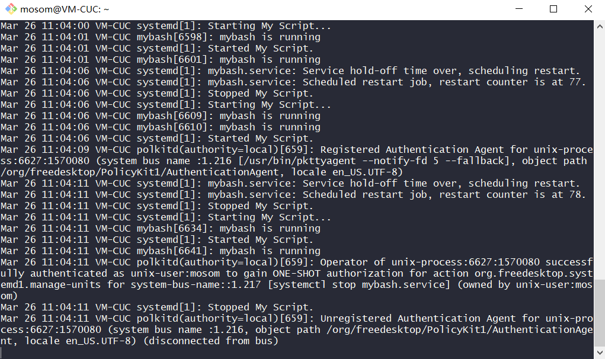

## 开机自启动项管理

### 实验要求

- systemd 操作全程录像

### 实验环境

Ubuntu18.04 Server
- 网卡：NAT、Host-Only
- 镜像：ubuntu-18.04.1-server-amd64.iso

Windows 10
- git bash (ssh)

### systemd 操作录像

Start

<a href="https://asciinema.org/a/Ibzc1rUJB5pojYrhdevlO3XGp?autoplay=1" target="_blank"></a>


Unit

<a href="https://asciinema.org/a/bzTr123XIPh1wgsi9QcATwcDY?autoplay=1" target="_blank"></a>


Strat/Stop/Restart

<a href="https://asciinema.org/a/pWn1GaZBA2Gaee2XPrWfaNEdy?autoplay=1" target="_blank"></a>


Unit files

<a href="https://asciinema.org/a/rJZ0JxWPKAx4Kil7Bd8QyUj22?autoplay=1" target="_blank"></a>


Journalctl

<a href="https://asciinema.org/a/iZh4QWtOVilbdENRl88wpCS7K?autoplay=1" target="_blank"></a>

### 自查清单

##### 1. 如何添加一个用户并使其具备sudo执行程序的权限？
##### 2. 如何将一个用户添加到一个用户组？

```bash
# 添加普通用户
sudo adduser cuc

# 切换到该用户
su cuc

# 无法执行 sudo
sudo su -

# 退出
exit

# 添加到 sudo 组
sudo adduser cuc sudo

# 切换到该用户
su cuc

# 可以执行 sudo
sudo su -
```

<a href="https://asciinema.org/a/dWUAqcwKpI59nmbV3JbsquxQw?autoplay=1" target="_blank"></a>

##### 3. 如何查看当前系统的分区表和文件系统详细信息？

- 分区表：`sudo fdisk -l` 或 `sudo sfdisk -l` 或 `cfdisk`
- 文件系统信息：`df -a`
- 分区表+文件系统信息：`lsblk -f -p`

##### 4. 如何实现开机自动挂载Virtualbox的共享目录分区？

以 Ubuntu 16.04 桌面版为例：

使用设备-共享文件夹-添加共享文件夹（名为codes）
- [ ] 只读分配
- [x] 自动挂载  # 设置了也无法自动挂载，需进行配置（尝试自动挂载）
- [x] 固定分配

```bash
# 新建挂载目录
mkdir ~/shared

# 挂载文件夹
sudo mount -t vboxsf codes ~/shared

# 修改配置文件
sudo gedit /etc/fstab

# 修改模块
sudo gedit /etc/modules
```

- [Mounting VirtualBox shared folders on Ubuntu Server 16.04 LTS](https://gist.github.com/estorgio/1d679f962e8209f8a9232f7593683265)

以 Ubuntu 18.04 为例：

安装增强功能

```bash
# 安装必要的依赖
sudo apt-get update
sudo apt-get install build-essential gcc make perl dkms
reboot

# 虚拟机控制台选择安装增强功能
# 挂载增强功能光盘
sudo mount /dev/cdrom /mnt

# 查看
cd /mnt
ls

# root 权限
sudo su

# 安装增强功能
./VBoxLinuxAdditions.run

# 重启
reboot
```

创建配置文件并启用

```bash
# 创建 挂载 配置文件
# Mount units must be named after the mount point directories they control. Example: the mount point /home/lennart must be configured in a unit file home-lennart.mount.
sudo vi /etc/systemd/system/mnt-tmp.mount

# 查看服务并激活开机启动
sudo systemctl list-unit-files | grep mnt-tmp.mount
sudo systemctl enable mnt-tmp.mount

# 创建 自动挂载 配置文件
sudo vi /etc/systemd/system/mnt-tmp.automount

# 查看服务并激活开机启动
sudo systemctl list-unit-files | grep mnt-tmp.automount
sudo systemctl enable mnt-tmp.automount
```

配置文件 `/etc/systemd/system/mnt-tmp.mount`
- 挂载目录

```bash
[Unit]
Description=vbox shared dir mount script
Requires=network-online.target
After=network-online.service

[Mount]
# 在 Virtualbox 共享文件夹设置里指定的 共享文件夹名称
What=Codes

# 挂载目录
Where=/mnt/tmp

# 指定挂载文件系统类型
Type=vboxsf

[Install]
WantedBy = multi-user.target
```

配置文件 `/etc/systemd/system/mnt-tmp.automount`
- 自动挂载

```bash
[Unit]
Description=vbox shared dir mount script
Requires=network-online.target
After=network-online.service

[Automount]
Where=/mnt/tmp
TimeoutIdleSec=10

[Install]
WantedBy = multi-user.target
```

- [How to Install VirtualBox Guest Additions in Ubuntu Server 18.04 LTS](https://www.virtualzero.net/blog/how-to-install-virtualbox-guest-additions-in-ubuntu-server-18.04-lts)
- [VirtualBox Guest Additions installation problem](https://askubuntu.com/questions/1035030/virtualbox-guest-additions-installation-problem/1035043)

##### 5. 基于LVM（逻辑分卷管理）的分区如何实现动态扩容和缩减容量？

使用 LVM2 工具集

```bash
# 逻辑卷信息
lvdisplay

# 缩容
lvreduce --size -1024m /dev/bogon-vg/root

# 扩容
lvextend --size +1024m /dev/bogon-vg/root

# 更改大小
lvresize --size +1024m /dev/bogon-vg/root
```

##### 6. 如何通过systemd设置实现在网络连通时运行一个指定脚本，在网络断开时运行另一个脚本？

编写脚本文件并给予可执行权限 `chmod +x filename`

```bash
# Query the status of network links
networkctl

# 查看网络状况
networkctl status enp0s3

# 断开网络
sudo ip link set enp0s3 down
networkctl status

# 连接网络
sudo ip link set enp0s3 up
networkctl status

# 使用 netplan
sudo ip link set enp0s3 down
sudo netplan apply
```

脚本配置 `/usr/lib/networkd-dispatcher`

```bash
# the device has a carrier, but is not yet ready for normal traffic
# dormant.d/demo.sh
#!/usr/bin/env bash
echo "$(date) $IFACE is dormant" >> /tmp/demo.log

# the device is powered up, but it does not yet have a carrier
# no-carrier.d/demo.sh
#!/usr/bin/env bash
echo "$(date) $IFACE has no carrier" >> /tmp/demo.log

# the device is powered down
# off.d/demo.sh
#!/usr/bin/env bash
echo "$(date) $IFACE is off" >> /tmp/demo.log

# the link has carrier and routable address configured
# routeable.d/demo.sh
#!/usr/bin/env bash
echo "$(date) $IFACE is routeable" >> /tmp/demo.log
```

<a href="https://asciinema.org/a/QD7RemXCXslMlgEyKZLNiuGfc?autoplay=1" target="_blank"></a>

##### 7. 如何通过systemd设置实现一个脚本在任何情况下被杀死之后会立即重新启动？实现杀不死？

编写脚本文件并赋予可执行权限

```bash
# 编辑脚本
vi mybash

# 以下为脚本内容
#!/bin/bash
echo "mybash is running"
```

编写配置文件
- > 添加新的 Unit 建议在 /etc/systemd/system 目录下创建配置文件

```bash
# 创建并编辑配置文件
sudo vi /lib/systemd/system/mybash.service

# 以下为配置文件内容
[Unit]
Description=My Script

[Service]
Type=forking
ExecStart=/usr/bin/mybash
ExecStop=/usr/bin/mybash
Restart=always
RestartSec=42s
RemainAfterExit=yes

[Install]
WantedBy=multi-user.target
```

重新加载并查看结果

```bash
# 重新加载配置文件
systemctl daemon-reload

# 启动该服务
systemctl start mybash.service

# 通过日志查看输出
journalctl -f

# 尝试停止服务，还真的停了emmmmm
systemctl stop mybash.service

# 再次查看日志
journalctl -n
```



##### 8. 其他

开机自启动项管理
- `systemctl list-unit-files | grep enabled`

配置每天自动安装更新
- `sudo dpkg-reconfigure unattended-upgrades`

```bash
# 编辑配置文件启用自动更新
vi /etc/apt/apt.conf.d/02periodic

# 以下为设置每天更新的配置信息
# Run the "unattended-upgrade" security upgrade script
# every n-days (0=disabled)
# Requires the package "unattended-upgrades" and will write
# a log in /var/log/unattended-upgrades
APT::Periodic::Unattended-Upgrade "1";
```

### 疑问
1. 网络断开的条件配置，`Before=network-online.target` ？
2. **脚本杀死后重启** 这个题意我可能跑偏了，配置文件加上 `ExecStop=/bin/systemd start mybash.service` ？
3. 共享文件使用 Samba 不是更方便吗？

### 参阅
- [systemd - system and service manager](https://wiki.debian.org/systemd)
- [What is the SHA256 that comes on the sshd entry in auth.log](https://serverfault.com/questions/888281/what-is-the-sha256-that-comes-on-the-sshd-entry-in-auth-log)
- [LVM](https://wiki.debian.org/LVM)
- [UnattendedUpgrades](https://wiki.debian.org/UnattendedUpgrades)
- [Mounting VirtualBox shared folders on Ubuntu Server 16.04 LTS](https://gist.github.com/estorgio/1d679f962e8209f8a9232f7593683265)
- [How to write startup script for systemd](https://unix.stackexchange.com/questions/47695/how-to-write-startup-script-for-systemd)
- [Running Services After the Network is up](https://www.freedesktop.org/wiki/Software/systemd/NetworkTarget/)
- [Backup Utilities](https://help.ubuntu.com/community/BackupYourSystem#Backup_Utilities)
- [LVM (简体中文)](https://wiki.archlinux.org/index.php/LVM_(%E7%AE%80%E4%BD%93%E4%B8%AD%E6%96%87))
- [通过systemd设置实现在网络连通时运行一个指定脚本，在网络断开时运行另一个脚本](https://asciinema.org/a/ND40x8WroOoDwjP2BWiR3ojLI)
- [Use pre-up, post-up, etc. hook scripts](https://netplan.io/faq#use-pre-up-post-up-etc-hook-scripts)
- [networkd-dispatcher](https://gitlab.com/craftyguy/networkd-dispatcher)
- [no explanation for the events in the networkd-dispatcher manpage](https://bugs.launchpad.net/ubuntu/+source/networkd-dispatcher/+bug/1787495)