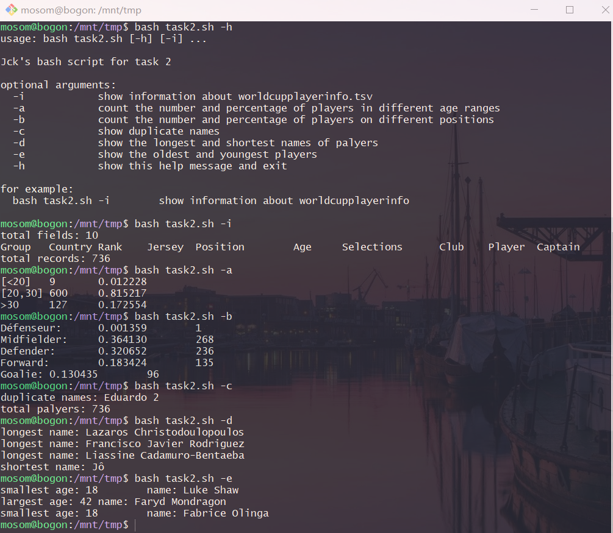
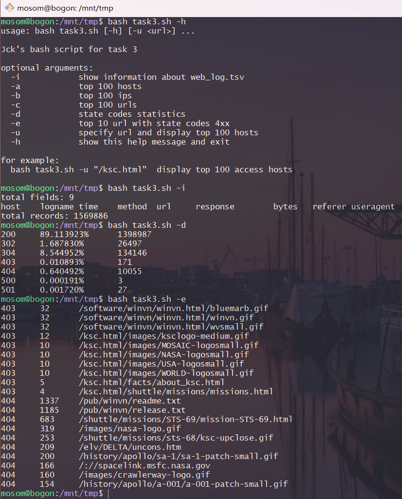

## shell脚本编程练习基础

- 文本处理（考察去重、统计、排序等操作）
- 文件批量重命名（简单重命名规则、复杂重命名规则）

### 实验要求

- 所有源代码文件必须单独提交并提供详细的脚本内置帮助信息
- 任务二的所有统计数据结果要求写入独立实验报告

### 实验环境准备

- 系统环境：Ubuntu 18.04
- [挂载共享文件夹](https://github.com/CUCCS/linux-2019-jckling/blob/0x03/0x03/%E5%AE%9E%E9%AA%8C%E6%8A%A5%E5%91%8A.md#4-%E5%A6%82%E4%BD%95%E5%AE%9E%E7%8E%B0%E5%BC%80%E6%9C%BA%E8%87%AA%E5%8A%A8%E6%8C%82%E8%BD%BDvirtualbox%E7%9A%84%E5%85%B1%E4%BA%AB%E7%9B%AE%E5%BD%95%E5%88%86%E5%8C%BA)
- 安装 ImageMagick 工具：`sudo apt install imagemagick-6.q16`

### 基本操作

convert 工具使用

```bash
# jpeg 质量压缩
convert filename1 -quality 50 filename2

# jpeg/png/svg 保持宽高比 压缩分辨率
convert filename1 -resize 50% filename2

# 添加自定义文本水印
convert filename1 -pointsize 50 -fill yellow -gravity center -draw "text 10,10 'Works like magick' " filename2

# 重命名 添加文件名前缀或后缀，不影响原始文件扩展名
mv xxx.png head_xxx.png
mv xxx.png xxx_tail.png

# 将 png/svg 图片统一转换为 jpg 格式图片
convert xxx.png xxx.jpg

# 批量处理
for file in *.png; do convert $file -rotate 90 rotated-$file; done
```

文件名相关

```bash
# image file format (file magic)
identify -format "%m" filename

# directory component of path
identify -format "%d" filename

# filename extension or suffix
identify -format "%e" filename

# filename (including suffix)
identify -format "%f" filename

# 文件后缀
FILE="example.tar.gz"
echo "${FILE%%.*}"
#example
echo "${FILE%.*}"   # this
#example.tar
echo "${FILE#*.}"
#tar.gz
echo "${FILE##*.}"  # this
#gz
```

### 任务

任务一：用bash编写一个图片批处理脚本，实现以下功能：
- 支持命令行参数方式使用不同功能
- 支持对指定目录下所有支持格式的图片文件进行批处理
- 支持以下常见图片批处理功能的单独使用或组合使用
    - 支持对jpeg格式图片进行图片质量压缩
    - 支持对jpeg/png/svg格式图片在保持原始宽高比的前提下压缩分辨率
    - 支持对图片批量添加自定义文本水印
    - 支持批量重命名（统一添加文件名前缀或后缀，不影响原始文件扩展名）
    - 支持将png/svg图片统一转换为jpg格式图片

task1.sh 将每个功能封装成函数，当组合使用时会产生中间文件，手动删除之
- `bash task1.sh -f test1/ -r 50 -t "CUC"`

task0.sh 对操作的支持对象类型取交集，最后得到满足所有操作的类型再进行处理，这样就没有中间结果
- `bash task0.sh -f test0/ -r 50 -t "linux"`

任务二：用bash编写一个文本批处理脚本，对以下附件分别进行批量处理完成相应的数据统计任务：
- 2014世界杯运动员数据
    - 统计不同年龄区间范围（20岁以下、[20-30]、30岁以上）的球员数量、百分比
    - 统计不同场上位置的球员数量、百分比
    - 名字最长的球员是谁？名字最短的球员是谁？
    - 年龄最大的球员是谁？年龄最小的球员是谁？

结果




任务三：用bash编写一个文本批处理脚本，对以下附件分别进行批量处理完成相应的数据统计任务：
- Web服务器访问日志
    - 统计访问来源主机TOP 100和分别对应出现的总次数
    - 统计访问来源主机TOP 100 IP和分别对应出现的总次数
    - 统计最频繁被访问的URL TOP 100
    - 统计不同响应状态码的出现次数和对应百分比
    - 分别统计不同4XX状态码对应的TOP 10 URL和对应出现的总次数
    - 给定URL输出TOP 100访问来源主机

部分结果



### 参阅
- [Percent Escape Handling](https://imagemagick.org/script/escape.php)
- [ImageMagick Text Handling ](http://xpt.sourceforge.net/techdocs/media/image/imagemagick/im04-TextHandling/ar01s02.html)
- [Extract filename and extension in Bash](https://stackoverflow.com/questions/965053/extract-filename-and-extension-in-bash)
- [dylanaraps/pure-bash-bible](https://github.com/dylanaraps/pure-bash-bible)
- [awk命令](http://man.linuxde.net/awk)
- [How can I send stdout to multiple commands?](https://unix.stackexchange.com/questions/28503/how-can-i-send-stdout-to-multiple-commands)
- [Bash Pitfalls](https://mywiki.wooledge.org/BashPitfalls)
- [How to pass array as an argument to a function in Bash](https://stackoverflow.com/questions/16461656/how-to-pass-array-as-an-argument-to-a-function-in-bash)
- [Add a new element to an array without specifying the index in Bash](https://stackoverflow.com/questions/1951506/add-a-new-element-to-an-array-without-specifying-the-index-in-bash)
- [Bash Reference Manual](https://www.gnu.org/software/bash/manual/html_node/index.html)
- [BASH Programming - Introduction HOW-TO](http://tldp.org/HOWTO/Bash-Prog-Intro-HOWTO.html)
- [Installing ImageMagick & Ghostscript on Ubuntu](https://gist.github.com/leomelzer/3949356)
- [Make Travis-CI push files to other repositories for you when tests pass](https://gist.github.com/Maumagnaguagno/84a9807ed71d233e5d3f)