## 高级Web服务器配置

### 实验环境

#### 虚拟机环境

Ubuntu 18.04 Server
- NAT
- Host-Only：192.168.56.102

#### 网站设置

Nginx
- wp.sec.cuc.edu.cn
    - wordpress
    - 4433
- dvwa.sec.cuc.edu.cn
    - 8090

VeryNginx
- vn.sec.cuc.edu.cn
    - 80
    - 443

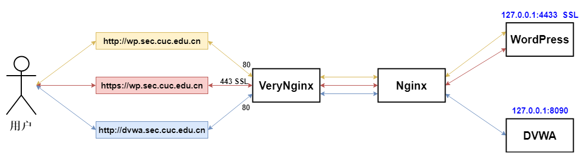

#### 安装

访问频率测试用

```bash
# benchmarking tool
sudo apt-get install apache2-utils 
```

##### Nginx 1.14.0

直接安装即可，默认监听 80 端口，之后进行修改

```bash
# install Nginx
sudo apt-get update
sudo apt-get install nginx

# install extension
sudo apt-get install mysql-server
sudo apt-get install php-fpm php-mysql php-gd zlib
```

##### WordPress 4.7

下载 WordPress 4.7 进行安装

```bash
# default no password
sudo mysql -u root -p

# mysql config
CREATE DATABASE wordpress DEFAULT CHARACTER SET utf8 COLLATE utf8_unicode_ci;
GRANT ALL ON wordpress.* TO 'wordpressuser'@'localhost' IDENTIFIED BY 'password';
FLUSH PRIVILEGES;
EXIT;

# download wordpress4.7
mkdir ~/tmp && cd ~/tmp
wget https://wordpress.org/wordpress-4.7.tar.gz
tar xzvf wordpress-4.7.tar.gz
# copy config file
cp wordpress/wp-config-sample.php wordpress/wp-config.php

# move to site directory
sudo cp -a wordpress/. /var/www/html/wordpress
sudo chown -R www-data:www-data /var/www/html/wordpress

# config wordpress
curl -s https://api.wordpress.org/secret-key/1.1/salt/
sudo vi /var/www/html/wordpress/wp-config.php

# config nginx
sudo vi /etc/nginx/sites-available/default

# restart nginx
sudo systemctl restart nginx
```

自签证书，启用 https 访问
- 强行偷懒：之后 Nginx 和 VeryNginx 上配置的证书使用同一个

```bash
# Self-Signed SSL Certificate
sudo openssl req -x509 -nodes -days 365 -newkey rsa:2048 -keyout /etc/ssl/private/nginx-selfsigned.key -out /etc/ssl/certs/nginx-selfsigned.crt
# CN
# Beijing
# Chaoyang
# CUC
# CS
# wp.sec.cuc.edu.cn
# jckling@email.com

# create config file
sudo vi /etc/nginx/snippets/self-signed.conf
# ssl_certificate /etc/ssl/certs/nginx-selfsigned.crt;
# ssl_certificate_key /etc/ssl/private/nginx-selfsigned.key;

# config nginx
sudo vi /etc/nginx/sites-available/default

# test configuration (optional, we haven't change nginx.conf)
sudo nginx -t

# restart nginx
sudo systemctl restart nginx
```

若用 VeryNginx 进行反向代理时，无法用域名访问 WordPress 站点，则修改数据库内容
- 可在 WordPress `仪表盘 - 设置` 中修改相关内容

```bash
# mysql
sudo mysql -u root -p

USE wordpress;

SELECT option_value FROM wp_options WHERE option_id = 1 AND option_name = 'siteurl';

SELECT option_value FROM wp_options WHERE option_id = 2 AND option_name = 'home';
```

参阅：
- [How To Install WordPress with LEMP on Ubuntu 18.04](https://www.digitalocean.com/community/tutorials/how-to-install-wordpress-with-lemp-on-ubuntu-18-04)
- [Nginx Wordpress](https://www.nginx.com/resources/wiki/start/topics/recipes/wordpress/)
- [How To Install Linux, Nginx, MySQL, PHP (LEMP stack) on Ubuntu 18.04](https://www.digitalocean.com/community/tutorials/how-to-install-linux-nginx-mysql-php-lemp-stack-ubuntu-18-04)
- [How To Create a Self-Signed SSL Certificate for Nginx in Ubuntu 18.04](https://www.digitalocean.com/community/tutorials/how-to-create-a-self-signed-ssl-certificate-for-nginx-in-ubuntu-18-04)
- [暴力解说之首次部署NGINX](https://segmentfault.com/a/1190000015917733)
- [Changing Port number in WordPress blog](https://stackoverflow.com/questions/16334094/changing-port-number-in-wordpress-blog)

##### DVWA 1.10

直接下载配置即可

```bash
# mysql config
sudo mysql -u root -p
CREATE USER DVWA;
CREATE DATABASE dvwa;
GRANT ALL ON dvwa.* to DVWA@localhost identified by 'p@ssw0rd';
FLUSH PRIVILEGES;
EXIT;

# download DVWA to site directory
cd /var/www/html/
sudo git clone https://github.com/ethicalhack3r/DVWA.git

# configuration
cd DVWA
sudo cp config/config.inc.php.dist config/config.inc.php
# sudo vi config/config.inc.php   # https://www.google.com/recaptcha/admin/create
sudo vi /etc/php/7.2/fpm/php.ini    # allow_url_include = Off -> On
sudo chmod 777 hackable/uploads/
sudo chmod 777 external/phpids/0.6/lib/IDS/tmp/phpids_log.txt
sudo chmod 777 config/
sudo vi config/config.inc.php   # $_DVWA[ 'db_user' ] = 'DVWA';

# restart php-fpm
sudo systemctl restart php7.2-fpm

# config nginx
sudo vi /etc/nginx/sites-available/default

# restart nginx
sudo systemctl restart nginx
```

参阅：
- [ethicalhack3r/DVWA](https://github.com/ethicalhack3r/DVWA)
- [Could not connect to the MySQL service. Please check the config file. #172](https://github.com/ethicalhack3r/DVWA/issues/172)

##### VeryNginx 

这玩意儿安装都是坑，找了不少相关办法尝试

```bash
# download
cd ~/tmp
git clone https://github.com/alexazhou/VeryNginx.git

# use python3 (optional)
sudo apt-get install python3
sudo update-alternatives --install /usr/local/bin/python python /usr/bin/python3 10

# dependence
sudo apt-get update
sudo apt-get install libpcre3 libpcre3-dev libssl-dev build-essential

# fix openssl error
sudo apt-get install libssl1.0-dev
#sudo apt-get install --reinstall zlibc zlib1g zlib1g-dev

# install, use sudo to create folders
cd VeryNginx
sudo python install.py install

# add user and set password
sudo adduser nginx

# start (bind to 80)
sudo /opt/verynginx/openresty/nginx/sbin/nginx

# config files
/opt/verynginx/openresty/nginx/conf
/opt/verynginx/verynginx/configs/
```

参阅：
- [alexazhou/VeryNginx](https://github.com/alexazhou/VeryNginx)
- [Trouble Shooting](https://github.com/alexazhou/VeryNginx/wiki/Trouble-Shooting)
- [Compile error using latest OpenSSL](https://github.com/kgretzky/evilginx/issues/2)
- [zlib library not found #38](https://github.com/kgretzky/evilginx/issues/38)

#### 其他配置

宿主机 Windows 修改 C:\Windows\System32\drivers\etc\hosts
- 添加域名解析

```
192.168.56.102	vn.sec.cuc.edu.cn
192.168.56.102	dvwa.sec.cuc.edu.cn
192.168.56.102	wp.sec.cuc.edu.cn
```

VeryNginx 配置反向代理

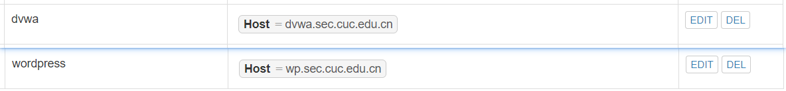

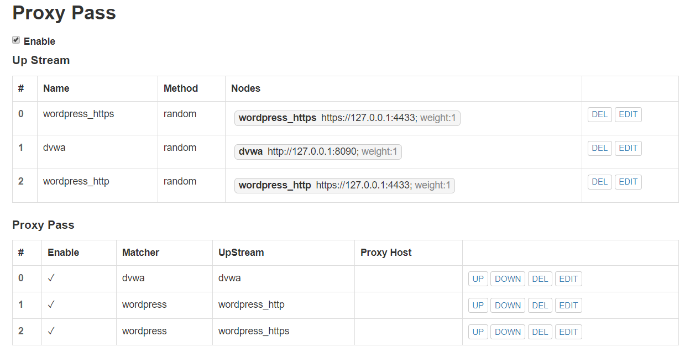

#### 环境搭建结果

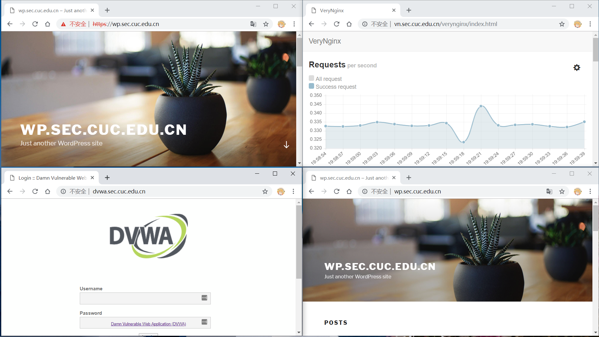

### 实验

#### 安全加固要求

##### 使用IP地址方式均无法访问上述任意站点，并向访客展示自定义的友好错误提示信息页面-1

以下配置截图：上方为 Matcher ，下方为 Filter

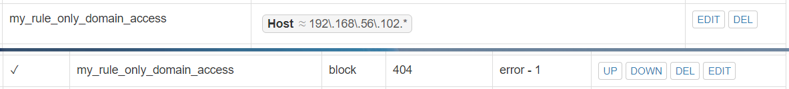

并没有监听别的端口 :no_mouth:

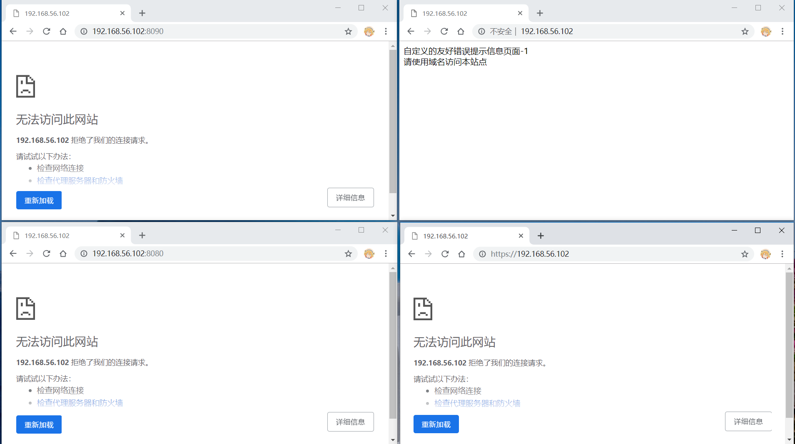

##### Damn Vulnerable Web Application (DVWA)只允许白名单上的访客来源IP，其他来源的IP访问均向访客展示自定义的友好错误提示信息页面-2

以下配置截图：上方为 Matcher ，下方为 Filter

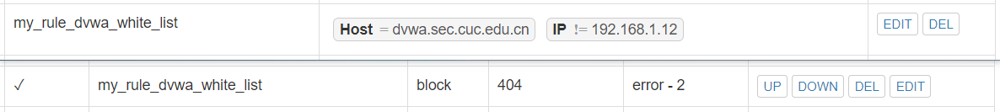

开启白名单限制后

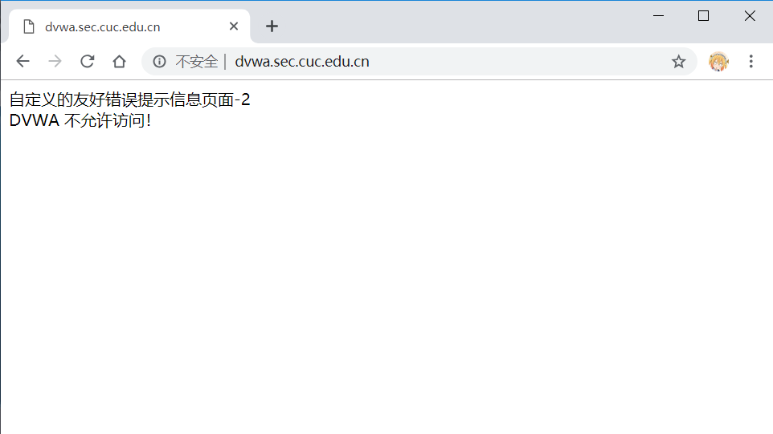

##### 在不升级Wordpress版本的情况下，通过定制VeryNginx的访问控制策略规则，热修复WordPress < 4.7.1 - Username Enumeration

直观看来禁止访问 URI 即可，以下配置截图：上方为 Matcher ，下方为 Filter

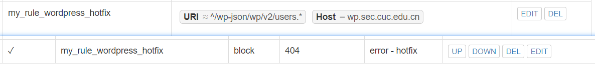

热修复前

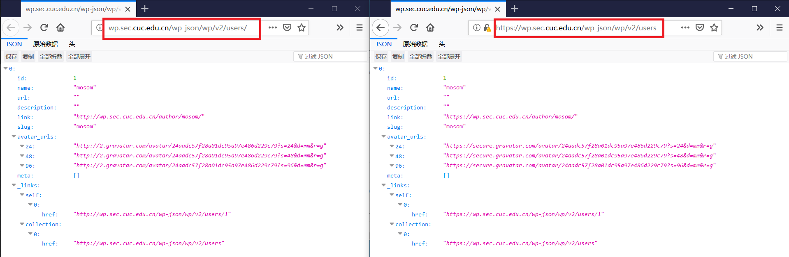

进行热修复后

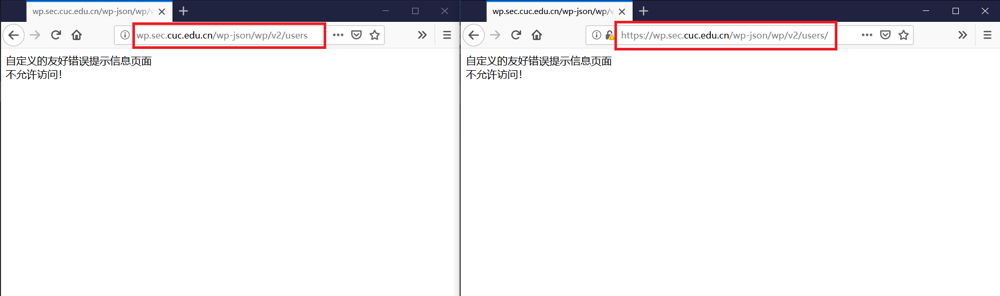

参阅：
- [WordPress < 4.7.1 - Username Enumeration](https://www.exploit-db.com/exploits/41497)

##### 通过配置VeryNginx的Filter规则实现对Damn Vulnerable Web Application (DVWA)的SQL注入实验在低安全等级条件下进行防护

匹配 Arg 字段

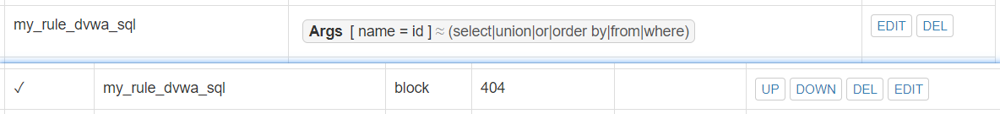

匹配前/后

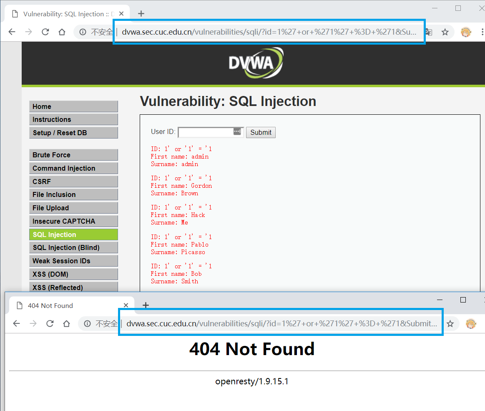

#### VERYNGINX配置要求

##### VeryNginx的Web管理页面仅允许白名单上的访客来源IP，其他来源的IP访问均向访客展示自定义的友好错误提示信息页面-3

以下配置截图：上方为 Matcher ，下方为 Filter

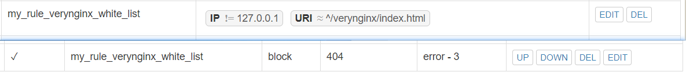

限制后，本地用 curl 访问一下好了...

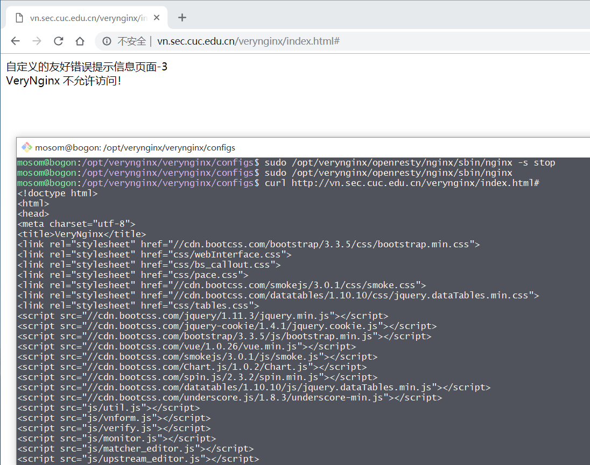

##### 通过定制VeryNginx的访问控制策略规则

限制DVWA站点的单IP访问速率为每秒请求数 < 50 && 限制Wordpress站点的单IP访问速率为每秒请求数 < 20
- 超过访问频率限制的请求直接返回自定义错误提示信息页面-4

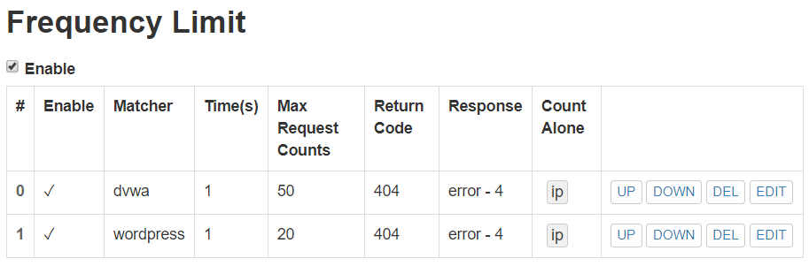

限制结果

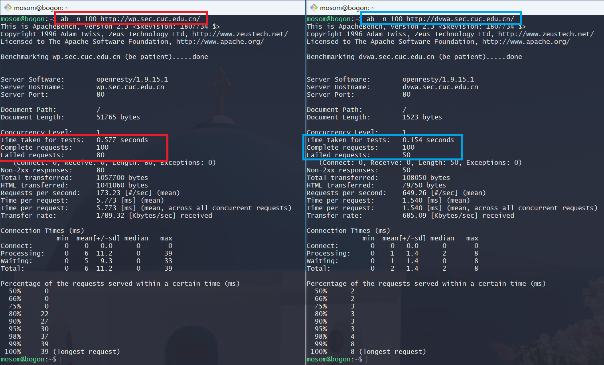

禁止curl访问，以下配置截图：上方为 Matcher ，下方为 Filter

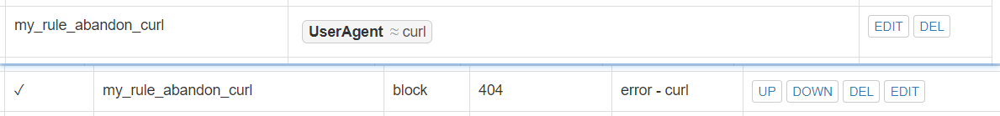

使用 curl 访问 `dvwa.sec.cuc.edu.cn`
- 开启过滤条件前/后

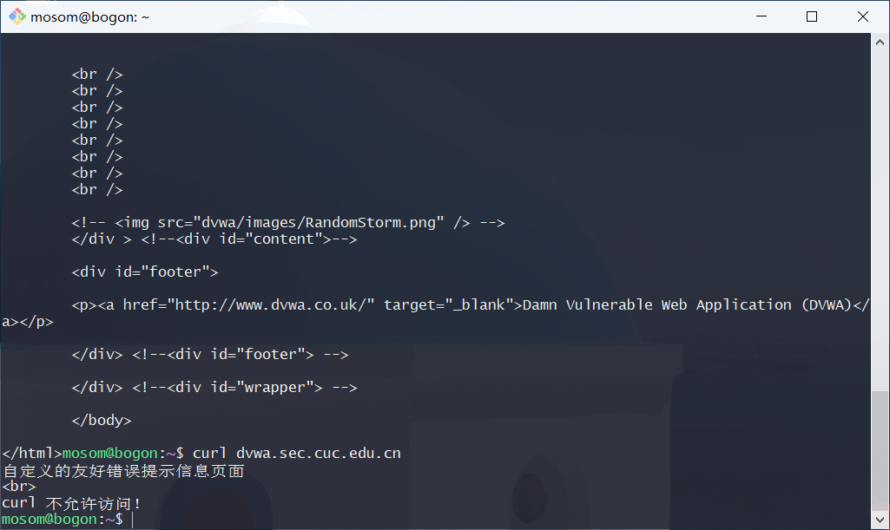


### 总结

1. 一开始同时使用 VeryNginx 和 Nginx 监听开放端口，导致部分实验直接绕过了 VeryNginx 访问到 Nginx，正确的做法是让 Nginx 只监听本地，用 VeryNginx 进行反向代理（仅开放 VeryNginx 监听的 80 端口）

2. WordPress 的 https 配置卡壳了不久，因为限制 http / https 二选一，而且设置保存在数据库中，后来全使用 https 让反向代理 *假装* 同时支持 http / https，存在问题是使用 http 访问站点时，点击网页内容中的链接将会跳转到 https 。

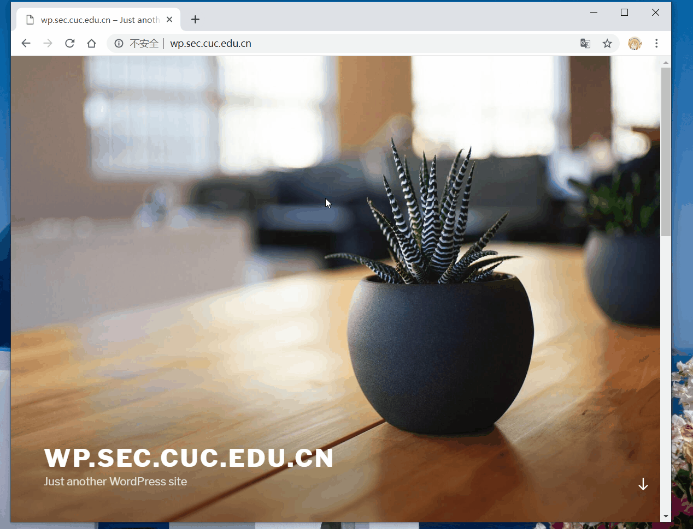

3. 以下为相关配置文件
- [/etc/nginx/sites-available/default](conf/default)
- [/opt/verynginx/openresty/nginx/conf/nginx.conf](conf/nginx.conf)
- [/opt/verynginx/verynginx/configs/config.json](conf/config.json)